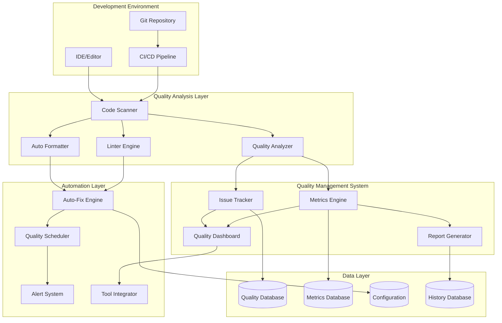

# Code Quality and Automated Fixes Design

## Overview

This design document outlines the technical architecture for implementing a comprehensive code quality tracking and automated fix system for the AITM platform. The solution combines automated code analysis, intelligent fixing, systematic tracking, and continuous improvement processes to maintain high code quality standards.

## Architecture

### High-Level Architecture



### Component Architecture

#### 1. Code Quality Scanner

**Purpose**: Continuously scan code for quality issues, style violations, and improvement opportunities
**Technology**: Python with AST analysis, integrated linting tools
**Key Features**:
- Real-time code analysis during development
- Integration with multiple quality tools (pylint, black, isort, mypy)
- Configurable quality rules and standards
- Performance impact monitoring

**Implementation Details**:
```python
class CodeQualityScanner:
    def __init__(self):
        self.analyzers = {
            'style': StyleAnalyzer(),
            'complexity': ComplexityAnalyzer(),
            'security': SecurityAnalyzer(),
            'performance': PerformanceAnalyzer()
        }
        self.formatters = {
            'python': PythonFormatter(),
            'javascript': JSFormatter(),
            'typescript': TSFormatter()
        }
    
    async def scan_file(self, file_path: str) -> QualityScanResult:
        results = []
        for analyzer_name, analyzer in self.analyzers.items():
            result = await analyzer.analyze(file_path)
            results.append(result)
        return QualityScanResult.combine(results)
```

#### 2. Auto-Fix Engine

**Purpose**: Automatically apply fixes for common code quality issues
**Technology**: Python with AST manipulation, rule-based fixing
**Key Features**:
- Safe automatic fixes for style and formatting issues
- Intelligent import organization
- Code structure improvements
- Rollback capability for problematic fixes

#### 3. Quality Metrics Engine

**Purpose**: Track and analyze code quality metrics over time
**Technology**: Python with time-series database integration
**Key Features**:
- Comprehensive metric collection
- Trend analysis and prediction
- Quality gate enforcement
- Comparative analysis across projects

#### 4. Issue Tracking System

**Purpose**: Systematically track and manage code quality issues
**Technology**: Integration with existing issue tracking systems
**Key Features**:
- Automatic issue creation and updates
- Priority-based issue management
- Resolution tracking and verification
- Technical debt quantification

## Components and Interfaces

### Backend Components

#### QualityManager
```python
class QualityManager:
    async def scan_codebase(self, project_path: str) -> QualityReport
    async def apply_auto_fixes(self, issues: List[QualityIssue]) -> FixResult
    async def track_quality_metrics(self, project_id: str) -> MetricsUpdate
    async def generate_quality_report(self, timeframe: TimeRange) -> QualityReport
```

#### AutoFixEngine
```python
class AutoFixEngine:
    async def analyze_fixable_issues(self, scan_result: QualityScanResult) -> List[FixableIssue]
    async def apply_fixes(self, issues: List[FixableIssue]) -> FixApplicationResult
    async def validate_fixes(self, applied_fixes: List[AppliedFix]) -> ValidationResult
    async def rollback_fixes(self, fix_batch_id: str) -> RollbackResult
```

#### QualityMetricsCollector
```python
class QualityMetricsCollector:
    async def collect_code_metrics(self, project_path: str) -> CodeMetrics
    async def collect_test_metrics(self, test_results: TestResults) -> TestMetrics
    async def collect_performance_metrics(self, perf_data: PerformanceData) -> PerfMetrics
    async def aggregate_metrics(self, metrics: List[Metrics]) -> AggregatedMetrics
```

### Frontend Components

#### QualityDashboard.svelte
```typescript
interface QualityDashboardProps {
    projectId: string;
    timeRange: TimeRange;
    metricTypes: string[];
}

class QualityDashboard {
    private metricsService: QualityMetricsService;
    private websocket: WebSocketConnection;
    
    async loadQualityMetrics(): Promise<QualityMetrics>
    async handleQualityAlert(alert: QualityAlert): Promise<void>
    onMetricsUpdate(callback: (metrics: QualityMetrics) => void): void
}
```

#### IssueTracker.svelte
```typescript
interface IssueTrackerProps {
    projectId: string;
    issueTypes: IssueType[];
    priorityFilter: Priority[];
}

class IssueTracker {
    private issueService: QualityIssueService;
    
    async loadIssues(filters: IssueFilters): Promise<QualityIssue[]>
    async resolveIssue(issueId: string): Promise<void>
    async bulkApplyFixes(issueIds: string[]): Promise<FixResult>
}
```

#### QualityTrends.svelte
```typescript
interface QualityTrendsProps {
    metrics: QualityMetrics[];
    timeRange: TimeRange;
    comparisonMode: 'project' | 'team' | 'historical';
}

class QualityTrends {
    private chartRenderer: ChartRenderer;
    
    renderTrendCharts(metrics: QualityMetrics[]): void
    handleTrendInteraction(event: TrendEvent): void
    exportTrendData(format: 'csv' | 'json' | 'pdf'): string
}
```

## Data Models

### Quality Models

```python
@dataclass
class QualityIssue:
    id: str
    file_path: str
    line_number: int
    issue_type: IssueType
    severity: Severity
    description: str
    suggested_fix: Optional[str]
    auto_fixable: bool
    created_at: datetime
    resolved_at: Optional[datetime]

@dataclass
class QualityMetrics:
    project_id: str
    timestamp: datetime
    code_coverage: float
    cyclomatic_complexity: float
    maintainability_index: float
    technical_debt_ratio: float
    test_quality_score: float
    security_score: float

@dataclass
class AutoFixResult:
    fix_id: str
    issue_id: str
    file_path: str
    original_content: str
    fixed_content: str
    fix_type: FixType
    success: bool
    error_message: Optional[str]
    applied_at: datetime
```

### Configuration Models

```python
@dataclass
class QualityStandards:
    max_complexity: int
    min_coverage: float
    max_line_length: int
    naming_conventions: Dict[str, str]
    security_rules: List[SecurityRule]
    performance_thresholds: Dict[str, float]

@dataclass
class AutoFixConfiguration:
    enabled_fix_types: List[FixType]
    safety_level: SafetyLevel
    backup_enabled: bool
    rollback_timeout: int
    excluded_patterns: List[str]
```

## Error Handling

### Quality Analysis Errors

1. **File Access Errors**: Handle locked files, permission issues
2. **Parse Errors**: Graceful handling of malformed code
3. **Tool Integration Failures**: Fallback to alternative analyzers
4. **Performance Issues**: Timeout handling and resource management

### Auto-Fix Errors

1. **Fix Application Failures**: Safe rollback mechanisms
2. **Syntax Errors**: Validation before applying fixes
3. **Merge Conflicts**: Intelligent conflict resolution
4. **Backup Failures**: Alternative backup strategies

## Testing Strategy

### Unit Testing
- **Quality Analyzers**: Test with known code patterns
- **Auto-Fix Engine**: Test fix application and rollback
- **Metrics Collection**: Test metric calculation accuracy
- **Issue Tracking**: Test issue lifecycle management

### Integration Testing
- **Tool Integration**: Test with real quality tools
- **Workflow Integration**: Test IDE and CI/CD integration
- **Database Integration**: Test metrics storage and retrieval
- **Real-time Updates**: Test WebSocket communication

### Quality Assurance
- **Fix Validation**: Ensure fixes don't break functionality
- **Performance Testing**: Ensure quality checks don't slow development
- **User Experience**: Test developer workflow integration
- **Reliability Testing**: Test system stability under load

## Performance Considerations

### Analysis Performance
- **Incremental Analysis**: Only analyze changed files
- **Parallel Processing**: Concurrent analysis of multiple files
- **Caching**: Cache analysis results for unchanged code
- **Background Processing**: Non-blocking quality checks

### Real-time Updates
- **Efficient WebSockets**: Optimized real-time communication
- **Selective Updates**: Only send relevant metric changes
- **Batched Updates**: Group related updates together
- **Client-side Caching**: Reduce server load

### Scalability
- **Distributed Analysis**: Scale analysis across multiple workers
- **Database Optimization**: Efficient storage and querying
- **Resource Management**: Monitor and limit resource usage
- **Auto-scaling**: Dynamic scaling based on workload

## Security Considerations

### Code Analysis Security
- **Safe Execution**: Sandboxed analysis environment
- **Access Control**: Restrict access to sensitive code
- **Audit Logging**: Track all quality-related activities
- **Data Protection**: Secure storage of code metrics

### Auto-Fix Security
- **Fix Validation**: Ensure fixes don't introduce vulnerabilities
- **Permission Management**: Control who can apply auto-fixes
- **Change Tracking**: Complete audit trail of all fixes
- **Rollback Security**: Secure rollback mechanisms

### Data Privacy
- **Metric Anonymization**: Protect developer privacy in metrics
- **Secure Transmission**: Encrypted communication channels
- **Data Retention**: Configurable data retention policies
- **Compliance**: Meet regulatory requirements for code analysis