# Data Flows and Component Relationships

## System Overview

The AITM system follows a layered architecture with clear separation of concerns and well-defined data flows between components. This document maps the complete request/response flows, component dependencies, and user context propagation throughout the system.

## High-Level System Architecture

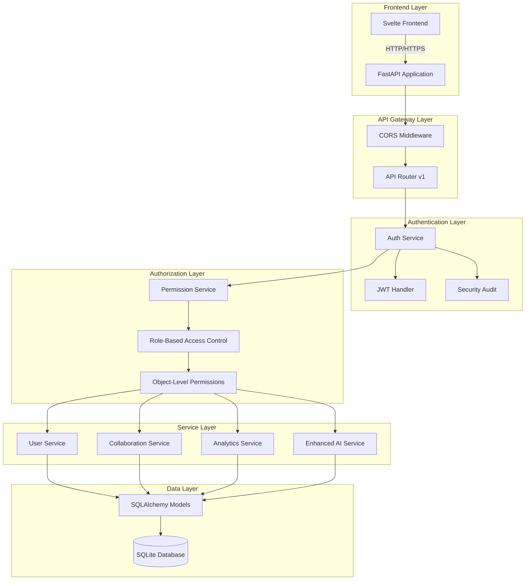

## Request/Response Flow Analysis

### 1. Project Creation Flow

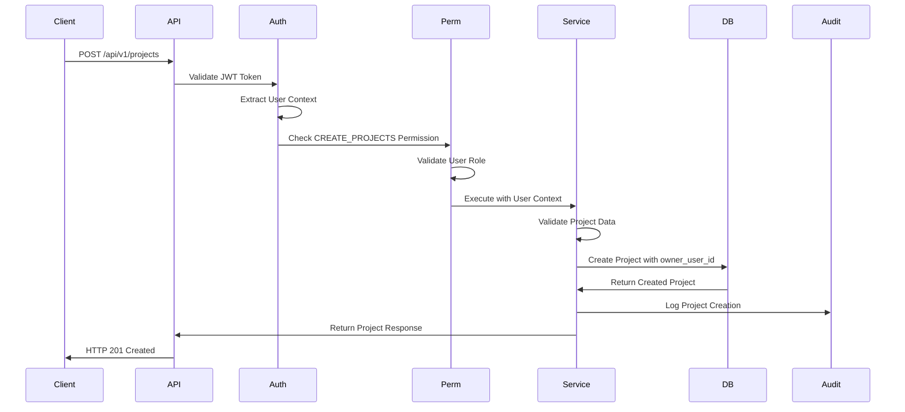

**Data Flow Details:**
1. **Client Request**: Frontend sends project creation request with JWT token
2. **Authentication**: API validates JWT token and extracts user context
3. **Authorization**: Permission service validates CREATE_PROJECTS permission
4. **Service Processing**: Project service validates data and sets ownership
5. **Database Operation**: SQLAlchemy creates project record with owner_user_id
6. **Audit Logging**: Security audit logs project creation event
7. **Response**: API returns created project data to client

### 2. Project Access Flow

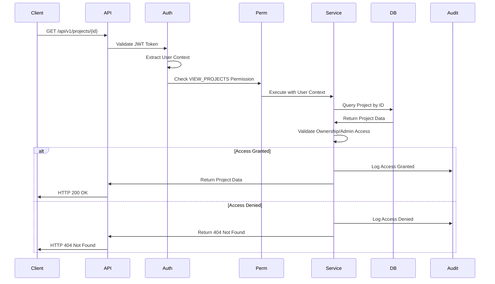

**Data Flow Details:**
1. **Client Request**: Frontend requests specific project by ID
2. **Authentication**: JWT token validated and user context extracted
3. **Permission Check**: VIEW_PROJECTS permission validated
4. **Database Query**: Project retrieved from database by ID
5. **Ownership Validation**: Service checks if user owns project or has admin privileges
6. **Access Decision**: Grant access if owned/admin, deny otherwise
7. **Audit Logging**: All access attempts logged for security monitoring
8. **Response**: Return project data or 404 for security through obscurity

### 3. User Authentication Flow

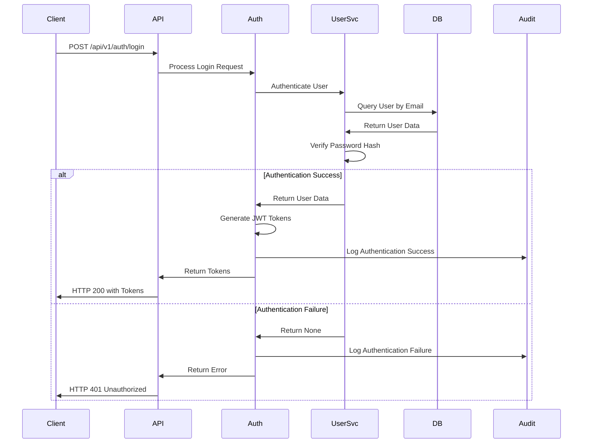

**Data Flow Details:**
1. **Login Request**: Client submits email/password credentials
2. **User Lookup**: User service queries database for user by email
3. **Password Verification**: BCrypt password hash verification
4. **Token Generation**: JWT access and refresh tokens created
5. **Audit Logging**: Authentication success/failure logged
6. **Response**: Tokens returned to client or error for failed authentication

## Component Dependencies

### Core Component Relationships

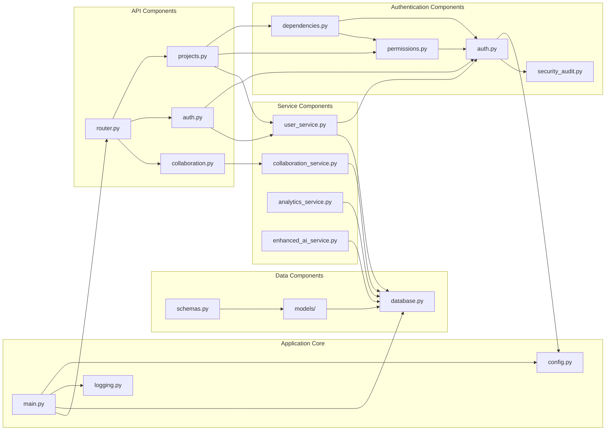

### Dependency Analysis

#### Authentication Dependencies
- **auth.py** depends on: config.py, security_audit.py
- **permissions.py** depends on: auth.py, database.py, models/user.py
- **dependencies.py** depends on: auth.py, permissions.py, database.py
- **security_audit.py** has no dependencies (base component)

#### Service Dependencies
- **user_service.py** depends on: auth.py, models/user.py, database.py
- **collaboration_service.py** depends on: database.py, models/collaboration.py
- **analytics_service.py** depends on: database.py, models/analytics.py
- **enhanced_ai_service.py** depends on: database.py, llm_providers/

#### API Dependencies
- **projects.py** depends on: dependencies.py, permissions.py, user_service.py
- **auth.py** depends on: auth.py, user_service.py, security_audit.py
- **collaboration.py** depends on: collaboration_service.py, permissions.py

## User Context Flow

### User Context Propagation

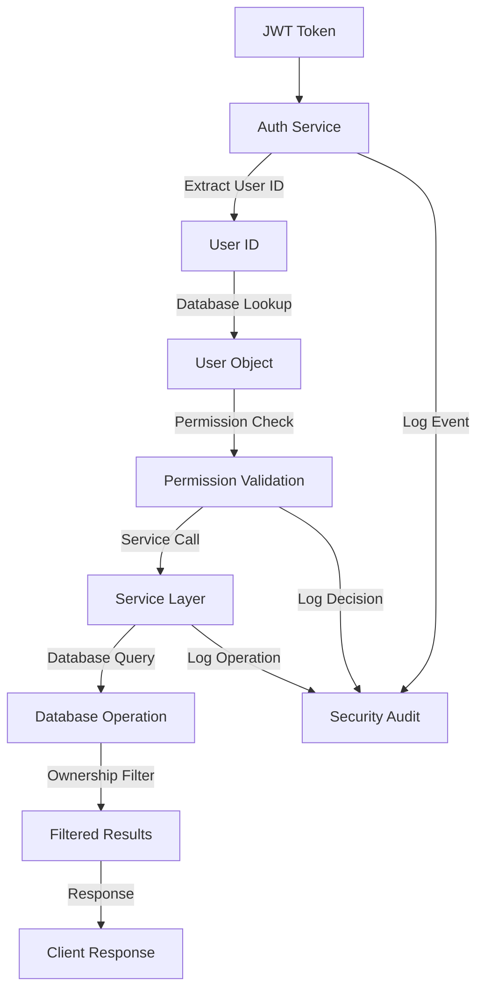

### User Context Components

#### 1. JWT Token Structure
```json
{
  "sub": "user_123",
  "exp": 1642694400,
  "iat": 1642608000,
  "type": "access",
  "role": "analyst"
}
```

#### 2. User Object Structure
```python
class User:
    id: str
    email: str
    full_name: str
    is_active: bool
    is_superuser: bool
    role: str  # viewer, analyst, admin, super_admin
    created_at: datetime
    updated_at: datetime
```

#### 3. Permission Context
```python
class PermissionChecker:
    def __init__(self, user: User):
        self.user = user
        self.permissions = get_role_permissions(user.role)
    
    def can_access_project(self, project) -> bool:
        return (project.owner_user_id == user.id or 
                user.role in ['admin', 'super_admin'])
```

## Integration Points

### Database Integration

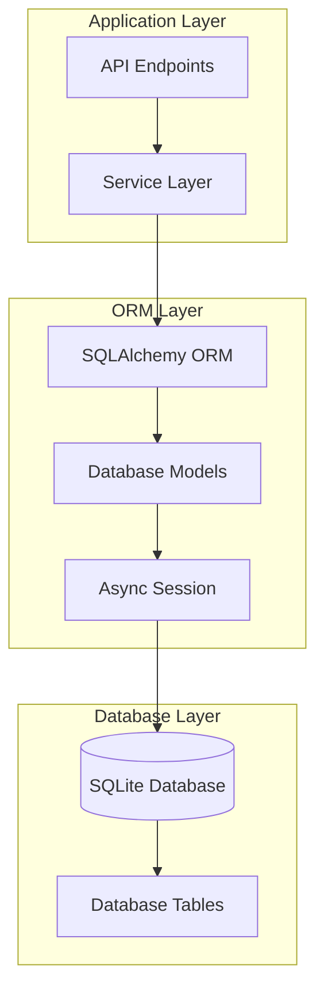

**Integration Details:**
- **Async Sessions**: All database operations use async SQLAlchemy sessions
- **Model Relationships**: SQLAlchemy relationships define foreign key constraints
- **Query Filtering**: Automatic filtering based on user context and permissions
- **Transaction Management**: Proper commit/rollback handling for data integrity

### External Service Integration

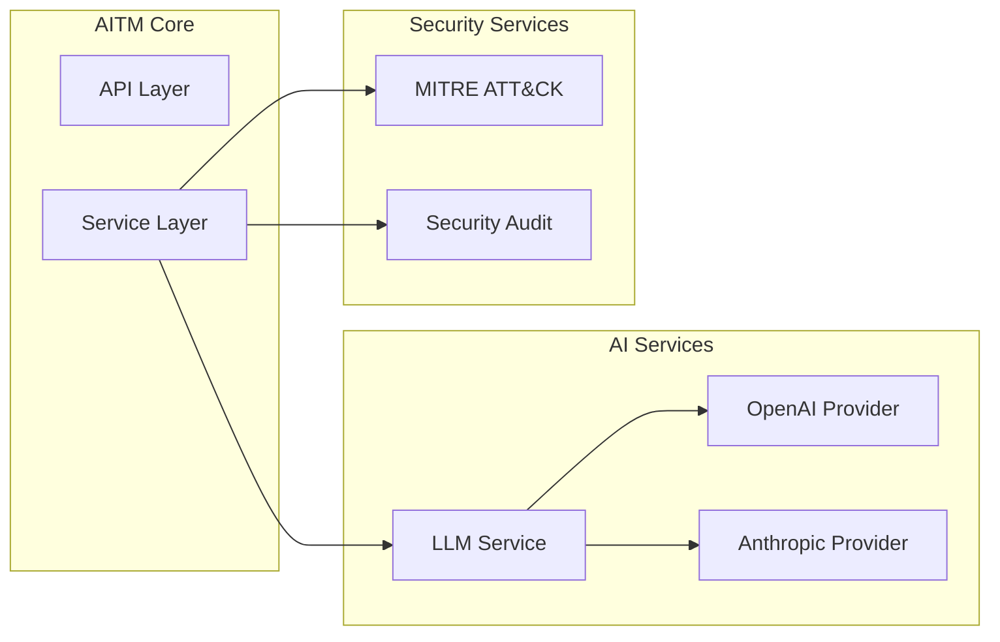

**Integration Points:**
- **LLM Providers**: Pluggable AI service providers for threat analysis
- **MITRE ATT&CK**: Integration with MITRE framework for threat intelligence
- **Security Audit**: Centralized logging for all security events
- **Configuration**: Environment-based configuration for different integrations

## Data Model Relationships

### Core Entity Relationships

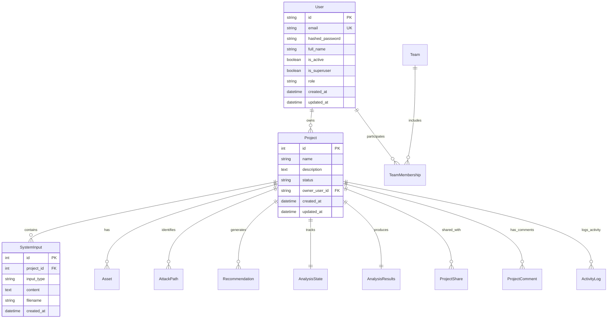

### Relationship Details

#### User-Project Relationship
- **One-to-Many**: Each user can own multiple projects
- **Ownership**: Projects have owner_user_id foreign key to users.id
- **Access Control**: Ownership determines base access permissions
- **Admin Override**: Admin users can access all projects regardless of ownership

#### Project-Analysis Relationship
- **One-to-One**: Each project has one analysis state and one analysis result
- **State Tracking**: AnalysisState tracks current analysis progress
- **Result Storage**: AnalysisResults stores completed analysis data
- **Lifecycle Management**: State and results created/updated during analysis

#### Collaboration Relationships
- **Team Membership**: Many-to-many relationship between users and teams
- **Project Sharing**: Projects can be shared with teams or individual users
- **Activity Logging**: All project activities logged with user context
- **Comment System**: Users can comment on projects they have access to

## Security Context Flow

### Authorization Decision Flow

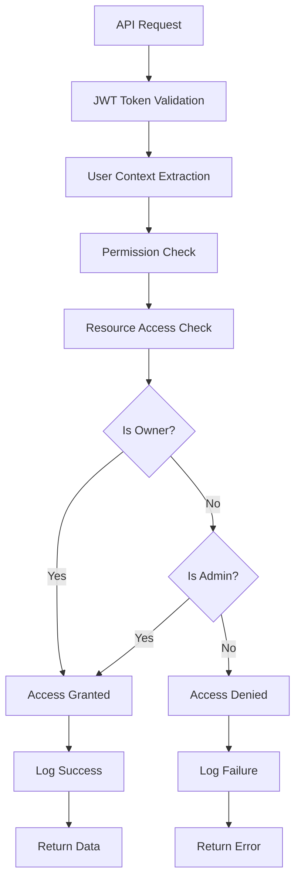

### Security Event Flow

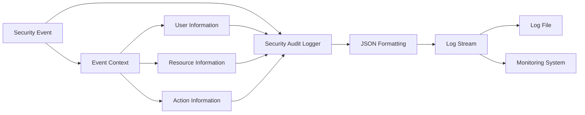

## Performance and Scalability Considerations

### Database Query Optimization
- **Indexed Queries**: Primary keys and foreign keys properly indexed
- **Filtered Queries**: Ownership-based filtering at database level
- **Async Operations**: Non-blocking database operations throughout
- **Connection Pooling**: SQLAlchemy connection pooling for efficiency

### Caching Strategy
- **User Context Caching**: JWT token validation results cached
- **Permission Caching**: Role-based permissions cached per user session
- **Static Data Caching**: MITRE ATT&CK data cached for performance
- **Query Result Caching**: Frequently accessed data cached appropriately

### Monitoring and Observability
- **Request Tracing**: Full request lifecycle tracking
- **Performance Metrics**: Response time and throughput monitoring
- **Error Tracking**: Comprehensive error logging and alerting
- **Security Monitoring**: Real-time security event monitoring

## Component Communication Patterns

### Synchronous Communication
- **API Endpoints**: HTTP request/response pattern
- **Service Calls**: Direct function calls within application
- **Database Operations**: Synchronous database queries with async/await
- **Authentication**: Real-time JWT validation and user lookup

### Asynchronous Communication
- **Background Tasks**: Analysis processing in background
- **Event Logging**: Asynchronous security event logging
- **Cache Updates**: Background cache refresh operations
- **Monitoring**: Asynchronous metrics collection

### Error Handling Patterns
- **Exception Propagation**: Structured exception handling throughout layers
- **Error Transformation**: Service errors transformed to appropriate HTTP responses
- **Audit Logging**: All errors logged with appropriate context
- **Client Communication**: Secure error messages without information leakage