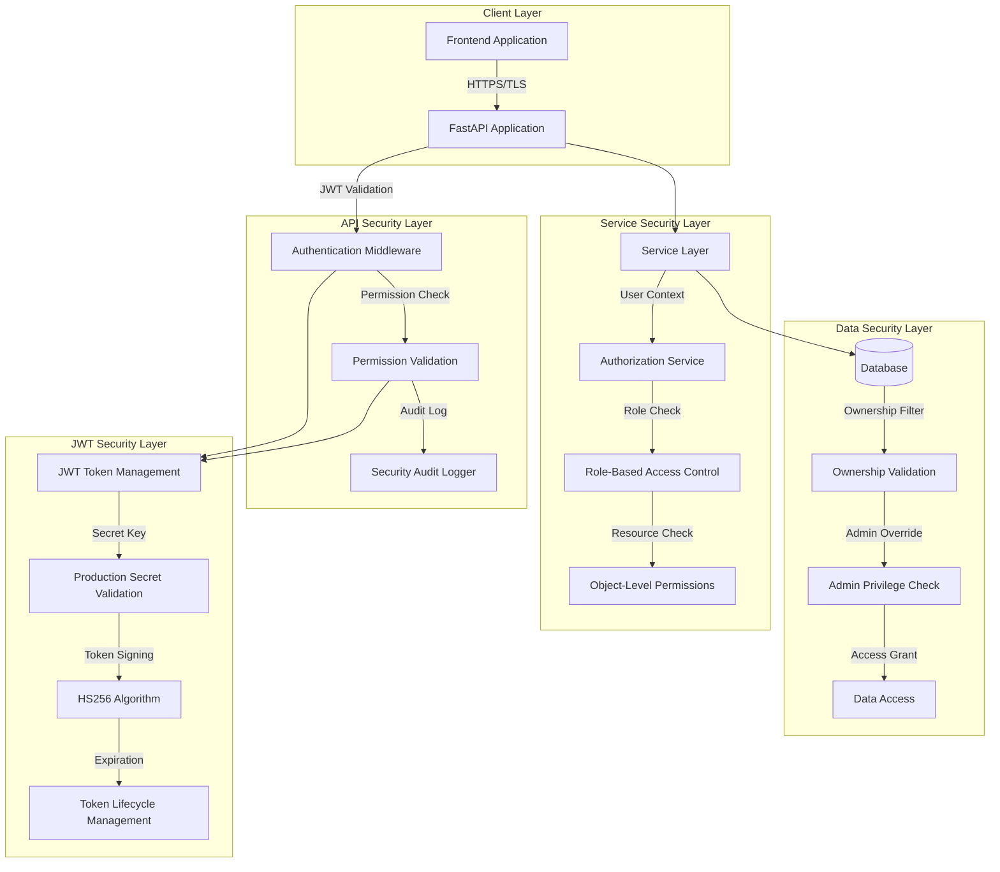

# Security Architecture Overview

## Executive Summary

The AITM (AI-Powered Threat Modeler) system implements a comprehensive multi-layered security architecture designed to protect sensitive threat modeling data and ensure proper access control. The security implementation follows defense-in-depth principles with four distinct security layers working in concert to provide robust protection.

## Security Layers Architecture



## Layer 1: API Security Layer

### Components
- **FastAPI Application**: Main application entry point with CORS configuration
- **Authentication Middleware**: JWT token validation and user context extraction
- **Permission Validation**: Role-based permission checking before endpoint access
- **Security Audit Logger**: Comprehensive logging of all security events

### Security Controls
- **JWT Token Validation**: All protected endpoints require valid JWT tokens
- **CORS Configuration**: Environment-specific CORS policies (restrictive in production)
- **Request Validation**: Input validation and sanitization at API boundaries
- **Error Handling**: Secure error responses that don't leak sensitive information

### Authorization Checkpoints
```python
# Example from projects.py
@router.post("/", response_model=ProjectResponse)
async def create_project(
    project: ProjectCreate,
    current_user: User = Depends(require_permission(Permission.CREATE_PROJECTS))
):
    # Permission validated before function execution
```

## Layer 2: Service Security Layer

### Components
- **Authorization Service**: Centralized authorization logic and user context management
- **Role-Based Access Control (RBAC)**: Hierarchical role system with granular permissions
- **Object-Level Permissions**: Resource-specific access control validation
- **User Service**: User management with secure password handling

### Role Hierarchy
```
SUPER_ADMIN (Full System Access)
    ├── ADMIN (Administrative Access)
    ├── ANALYST (Security Analysis Access)
    ├── VIEWER (Read-Only Access)
    └── API_USER (API-Only Access)
```

### Permission Matrix
| Permission | SUPER_ADMIN | ADMIN | ANALYST | VIEWER | API_USER |
|------------|-------------|-------|---------|--------|----------|
| CREATE_PROJECTS | ✓ | ✓ | ✓ | ✗ | ✗ |
| VIEW_PROJECTS | ✓ | ✓ | ✓ | ✓ | ✓ |
| EDIT_PROJECTS | ✓ | ✓ | ✓ | ✗ | ✗ |
| DELETE_PROJECTS | ✓ | ✓ | ✗ | ✗ | ✗ |
| MANAGE_USERS | ✓ | ✓ | ✗ | ✗ | ✗ |
| VIEW_ANALYTICS | ✓ | ✓ | ✓ | ✓ | ✗ |

## Layer 3: Data Security Layer

### Components
- **Database Access Control**: SQLAlchemy-based secure database interactions
- **Ownership Validation**: Project-level ownership verification
- **Admin Privilege Checks**: Elevated access for administrative roles
- **Data Filtering**: Query-level filtering based on user permissions

### Ownership-Based Access Control
```python
def can_access_project(user: User, project) -> bool:
    # Project owners can always access their projects
    if project.owner_user_id == user.id:
        return True
    
    # Admins and super admins can access all projects
    if user.role in [Role.ADMIN.value, Role.SUPER_ADMIN.value]:
        return True
    
    # Deny access by default
    return False
```

### Data Access Patterns
- **User Projects**: Users can only access projects they own
- **Admin Override**: Administrators can access all projects
- **Filtered Queries**: Database queries automatically filter by ownership
- **Defense in Depth**: Multiple validation layers prevent unauthorized access

## Layer 4: JWT Security Layer

### Components
- **JWT Token Management**: Secure token creation, validation, and lifecycle management
- **Production Secret Validation**: Comprehensive secret key security validation
- **Token Signing**: HS256 algorithm with secure key management
- **Token Lifecycle**: Proper expiration and refresh token handling

### Security Features
- **Production Secret Validation**: Enforces 32+ character secrets in production
- **Weak Key Detection**: Prevents use of default or common weak keys
- **Environment-Specific Configuration**: Different security levels for dev/prod
- **Token Expiration**: Configurable access token (30 min) and refresh token (7 days) lifetimes

### JWT Configuration Validation
```python
def validate_production_config():
    if environment == "production":
        if not secret_key or len(secret_key) < 32:
            raise RuntimeError("SECRET_KEY too weak for production")
        
        if secret_key.lower() in weak_keys:
            raise RuntimeError("SECRET_KEY appears to be default/weak value")
```

## Security Component Interactions

### Authentication Flow
1. **Client Request**: Frontend sends request with JWT token
2. **Token Validation**: API layer validates JWT signature and expiration
3. **User Context**: Service layer extracts user information from token
4. **Permission Check**: RBAC system validates user permissions
5. **Resource Access**: Data layer applies ownership-based filtering
6. **Audit Logging**: Security events logged for monitoring

### Authorization Flow
1. **Permission Requirement**: Endpoint specifies required permissions
2. **User Role Lookup**: System retrieves user's role and permissions
3. **Permission Validation**: Checks if user has required permissions
4. **Resource-Level Check**: Validates access to specific resources
5. **Admin Override**: Applies administrative privileges if applicable
6. **Access Decision**: Grants or denies access with appropriate logging

## Security Audit and Monitoring

### Audit Events
- **Authentication Events**: Login success/failure, token refresh, logout
- **Authorization Events**: Permission granted/denied, role checks
- **Resource Access**: Project access granted/denied, modification attempts
- **Administrative Actions**: User management, role changes, system configuration

### Audit Log Structure
```json
{
  "timestamp": "2024-01-15T10:30:00Z",
  "event_type": "project_access_denied",
  "user_id": "user_123",
  "user_role": "viewer",
  "resource_type": "project",
  "resource_id": "project_456",
  "result": "denied",
  "error_code": "INSUFFICIENT_PERMISSIONS"
}
```

### Security Monitoring
- **Failed Authentication Attempts**: Tracked and logged for security analysis
- **Permission Violations**: Unauthorized access attempts logged with context
- **Administrative Actions**: All admin operations logged with full audit trail
- **Configuration Changes**: Security configuration changes tracked

## Security Validation Points

### API Endpoints
- **Authentication Required**: All protected endpoints validate JWT tokens
- **Permission Enforcement**: Role-based permissions checked before processing
- **Input Validation**: Request data validated and sanitized
- **Error Handling**: Secure error responses without information leakage

### Service Layer
- **User Context Validation**: User active status and role verification
- **Business Logic Security**: Authorization checks within service methods
- **Data Access Control**: Ownership and permission validation before data access
- **Cross-Service Security**: Consistent security context across service calls

### Database Layer
- **Query Filtering**: Automatic filtering based on user permissions
- **Ownership Validation**: Project ownership verified at database level
- **Admin Overrides**: Administrative access properly controlled
- **Data Integrity**: Referential integrity and constraint enforcement

## Production Security Considerations

### Environment Configuration
- **Secret Management**: Secure JWT secret key generation and storage
- **CORS Policies**: Restrictive CORS configuration for production
- **HTTPS Enforcement**: TLS/SSL required for all communications
- **Error Handling**: Production-safe error messages

### Monitoring and Alerting
- **Security Event Monitoring**: Real-time monitoring of security events
- **Failed Authentication Alerts**: Automated alerts for suspicious activity
- **Permission Violation Tracking**: Monitoring unauthorized access attempts
- **Configuration Validation**: Startup validation of security configuration

### Compliance and Auditing
- **Audit Trail**: Comprehensive logging of all security-relevant events
- **Data Protection**: User data protection and privacy controls
- **Access Reviews**: Regular review of user permissions and access
- **Security Testing**: Regular security testing and vulnerability assessment

## Security Architecture Benefits

### Defense in Depth
- **Multiple Security Layers**: Four distinct layers provide comprehensive protection
- **Redundant Controls**: Multiple validation points prevent single points of failure
- **Layered Validation**: Each layer provides independent security validation
- **Comprehensive Coverage**: Security controls cover all system components

### Scalability and Maintainability
- **Centralized Security Logic**: Security services provide consistent enforcement
- **Modular Design**: Security components can be updated independently
- **Clear Separation**: Security concerns separated from business logic
- **Extensible Framework**: Easy to add new security controls and permissions

### Operational Security
- **Comprehensive Logging**: Full audit trail for security analysis
- **Real-time Monitoring**: Immediate detection of security events
- **Automated Validation**: Startup validation prevents misconfigurations
- **Production Hardening**: Environment-specific security controls