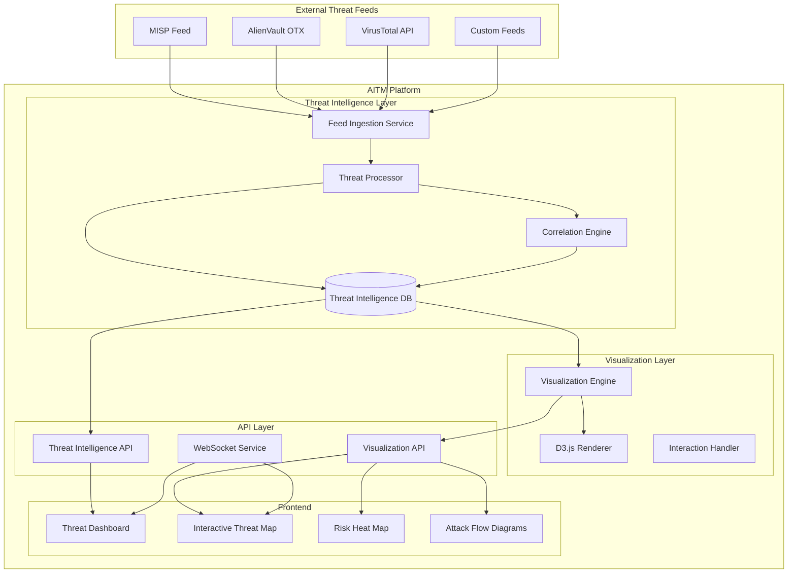

# Threat Intelligence Integration & Interactive Visualization Design

## Overview

This design document outlines the technical architecture for implementing real-time threat intelligence integration and interactive threat visualization capabilities in the AITM platform. The solution combines multiple threat intelligence feeds with advanced visualization techniques to provide security analysts with comprehensive, real-time threat awareness and intuitive visual analysis tools.

## Architecture

### High-Level Architecture



### Component Architecture

#### 1. Threat Intelligence Ingestion Service

**Purpose**: Continuously ingest threat data from multiple external sources
**Technology**: Python with asyncio for concurrent feed processing
**Key Features**:
- Multi-source feed management with individual rate limiting
- Configurable polling intervals and retry logic
- Data validation and normalization
- Source attribution and provenance tracking

**Implementation Details**:
```python
class ThreatFeedIngestion:
    def __init__(self):
        self.feeds = {
            'misp': MISPFeedHandler(),
            'otx': OTXFeedHandler(), 
            'virustotal': VirusTotalHandler()
        }
        self.rate_limiters = {}
        self.health_monitors = {}
    
    async def ingest_all_feeds(self):
        tasks = [self.ingest_feed(name, handler) 
                for name, handler in self.feeds.items()]
        await asyncio.gather(*tasks, return_exceptions=True)
```

#### 2. Threat Processing Engine

**Purpose**: Process, normalize, and enrich raw threat intelligence data
**Technology**: Python with pandas for data processing, Redis for caching
**Key Features**:
- STIX/TAXII format normalization
- Threat indicator extraction and classification
- Confidence scoring and source weighting
- Duplicate detection and merging

#### 3. Correlation Engine

**Purpose**: Correlate new threat intelligence with existing threat models and projects
**Technology**: Python with machine learning libraries (scikit-learn)
**Key Features**:
- Asset-based threat matching
- Contextual relevance scoring
- Automated alert generation
- Learning from analyst feedback

#### 4. Visualization Engine

**Purpose**: Transform threat data into visualization-ready formats
**Technology**: Python backend with D3.js frontend rendering
**Key Features**:
- Graph layout algorithms (force-directed, hierarchical)
- Real-time data streaming
- Level-of-detail rendering for performance
- Interactive event handling

## Components and Interfaces

### Backend Components

#### ThreatIntelligenceService
```python
class ThreatIntelligenceService:
    async def get_latest_threats(self, limit: int = 100) -> List[ThreatIndicator]
    async def search_threats(self, query: ThreatQuery) -> ThreatSearchResult
    async def correlate_with_project(self, project_id: str) -> List[ThreatCorrelation]
    async def get_threat_timeline(self, timeframe: TimeRange) -> List[ThreatEvent]
```

#### VisualizationService
```python
class VisualizationService:
    async def generate_threat_graph(self, project_id: str) -> ThreatGraph
    async def create_risk_heatmap(self, assets: List[Asset]) -> HeatMapData
    async def build_attack_flow(self, threat_scenario: ThreatScenario) -> AttackFlow
    async def get_visualization_data(self, viz_type: str, params: dict) -> dict
```

#### WebSocketManager
```python
class WebSocketManager:
    async def broadcast_threat_update(self, threat: ThreatIndicator)
    async def send_visualization_update(self, user_id: str, update: VizUpdate)
    async def handle_user_interaction(self, user_id: str, interaction: UserInteraction)
```

### Frontend Components

#### ThreatIntelligenceDashboard.svelte
```typescript
interface ThreatDashboardProps {
    refreshInterval: number;
    feedSources: string[];
    alertThreshold: number;
}

class ThreatDashboard {
    private threatService: ThreatIntelligenceService;
    private websocket: WebSocketConnection;
    
    async loadLatestThreats(): Promise<ThreatIndicator[]>
    async handleThreatAlert(alert: ThreatAlert): Promise<void>
    onThreatUpdate(callback: (threat: ThreatIndicator) => void): void
}
```

#### InteractiveThreatMap.svelte
```typescript
interface ThreatMapProps {
    width: number;
    height: number;
    data: ThreatGraphData;
    interactionMode: 'explore' | 'edit' | 'present';
}

class InteractiveThreatMap {
    private d3Container: d3.Selection;
    private simulation: d3.ForceSimulation;
    
    renderThreatGraph(data: ThreatGraphData): void
    handleNodeClick(node: ThreatNode): void
    updateVisualization(updates: ThreatUpdate[]): void
    exportVisualization(format: 'svg' | 'png' | 'json'): string
}
```

#### RiskHeatMap.svelte
```typescript
interface HeatMapProps {
    data: RiskData[][];
    colorScheme: ColorScheme;
    dimensions: { width: number; height: number };
}

class RiskHeatMap {
    private heatmapRenderer: HeatMapRenderer;
    
    generateHeatMap(riskData: RiskData[][]): void
    handleCellInteraction(cell: RiskCell): void
    updateRiskLevels(updates: RiskUpdate[]): void
}
```

## Data Models

### Threat Intelligence Models

```python
@dataclass
class ThreatIndicator:
    id: str
    type: ThreatType  # IOC, TTPs, Malware, etc.
    value: str
    confidence: float
    severity: SeverityLevel
    source: str
    first_seen: datetime
    last_seen: datetime
    tags: List[str]
    relationships: List[ThreatRelationship]

@dataclass
class ThreatCorrelation:
    threat_id: str
    project_id: str
    asset_id: str
    relevance_score: float
    correlation_type: CorrelationType
    created_at: datetime

@dataclass
class ThreatFeed:
    name: str
    url: str
    api_key: Optional[str]
    format: FeedFormat  # STIX, JSON, XML
    polling_interval: int
    rate_limit: int
    is_active: bool
    last_update: datetime
```

### Visualization Models

```python
@dataclass
class ThreatNode:
    id: str
    label: str
    type: NodeType
    risk_level: float
    position: Point2D
    metadata: dict
    connections: List[str]

@dataclass
class ThreatEdge:
    source: str
    target: str
    relationship_type: RelationshipType
    weight: float
    metadata: dict

@dataclass
class ThreatGraph:
    nodes: List[ThreatNode]
    edges: List[ThreatEdge]
    layout: LayoutType
    metadata: GraphMetadata
```

## Error Handling

### Threat Feed Error Handling

1. **Connection Failures**: Implement exponential backoff with jitter
2. **Rate Limiting**: Respect API limits with intelligent queuing
3. **Data Validation Errors**: Log and skip invalid records, alert administrators
4. **Authentication Failures**: Automatic token refresh where possible
5. **Partial Failures**: Continue processing other feeds, maintain service availability

### Visualization Error Handling

1. **Rendering Failures**: Graceful degradation to simpler visualizations
2. **Performance Issues**: Automatic level-of-detail reduction
3. **Data Loading Errors**: Display cached data with staleness indicators
4. **User Interaction Errors**: Provide clear feedback and recovery options

## Testing Strategy

### Unit Testing
- **Threat Feed Handlers**: Mock external APIs, test data processing logic
- **Correlation Engine**: Test matching algorithms with known datasets
- **Visualization Components**: Test rendering logic with synthetic data
- **API Endpoints**: Test request/response handling and error cases

### Integration Testing
- **End-to-End Feed Processing**: Test complete ingestion pipeline
- **Real-time Updates**: Test WebSocket communication and data flow
- **Cross-Component Integration**: Test threat intelligence to visualization pipeline
- **Performance Testing**: Load testing with realistic data volumes

### User Acceptance Testing
- **Analyst Workflows**: Test common threat analysis scenarios
- **Dashboard Usability**: Test dashboard effectiveness with security teams
- **Visualization Interaction**: Test user interaction patterns and feedback
- **Alert Response**: Test alert handling and investigation workflows

## Performance Considerations

### Backend Performance
- **Async Processing**: Use asyncio for concurrent feed processing
- **Database Optimization**: Implement proper indexing for threat data queries
- **Caching Strategy**: Redis caching for frequently accessed threat data
- **Background Processing**: Queue-based processing for heavy correlation tasks

### Frontend Performance
- **Visualization Optimization**: Canvas rendering for large datasets
- **Progressive Loading**: Load visualizations incrementally
- **Memory Management**: Efficient cleanup of D3.js objects
- **Real-time Updates**: Debounced updates to prevent UI thrashing

### Scalability
- **Horizontal Scaling**: Containerized services with load balancing
- **Data Partitioning**: Time-based partitioning for threat intelligence data
- **CDN Integration**: Static asset delivery optimization
- **Auto-scaling**: Kubernetes-based auto-scaling for processing services

## Security Considerations

### Data Protection
- **Encryption**: AES-256 encryption for threat intelligence data at rest
- **Transport Security**: TLS 1.3 for all external API communications
- **Access Control**: Role-based access to threat intelligence features
- **Data Classification**: Automatic classification of sensitive threat data

### API Security
- **Authentication**: JWT tokens with short expiration times
- **Rate Limiting**: Per-user and per-endpoint rate limiting
- **Input Validation**: Comprehensive validation of all user inputs
- **Audit Logging**: Complete audit trail of threat intelligence access

### Compliance
- **Data Retention**: Configurable retention policies for threat data
- **Source Attribution**: Maintain proper attribution for all threat sources
- **Export Controls**: Respect threat feed licensing and sharing restrictions
- **Privacy Protection**: Anonymization of sensitive threat indicators where required