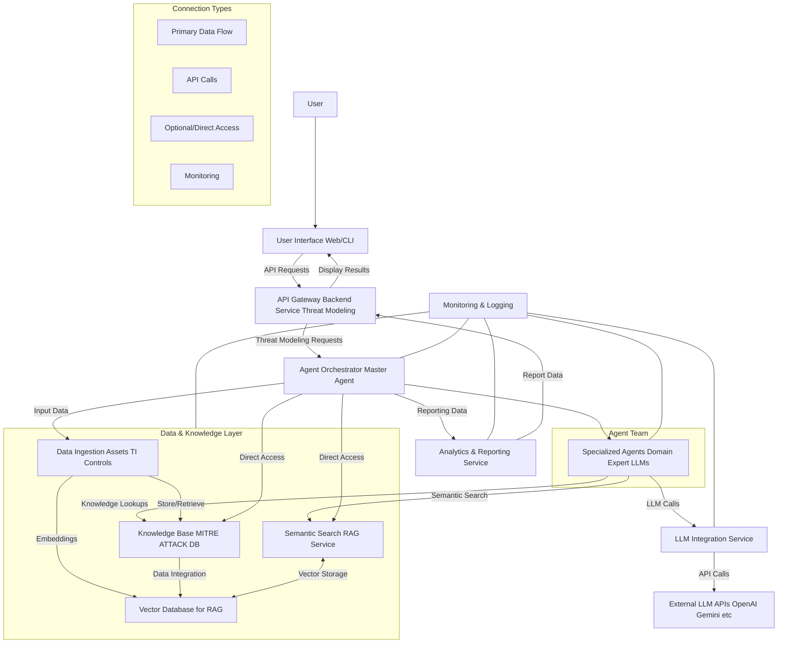

## Software Engineering Specification: AI-Powered Threat Modeler (AITM)

**Version:** 1.0
**Date:** August 5, 2025
**Author:** Ifiok Moses

---

## 1. Introduction

### 1.1. Purpose
The purpose of this document is to provide a comprehensive specification for the design, development, and deployment of the AI-Powered Threat Modeler (AITM) system. AITM aims to automate and enhance the cybersecurity threat modeling process by leveraging advanced LLM capabilities within a multi-agent architecture, integrated with the MITRE ATT&CK framework. This system will enable organizations to proactively identify, analyze, and mitigate potential cyber threats with greater efficiency, consistency, and depth than manual methods.

### 1.2. Scope
The AITM system will:
*   Ingest diverse input data describing target systems, applications, and networks.
*   Automate the identification of critical assets and system components.
*   Dynamically map system characteristics and potential vulnerabilities to MITRE ATT&CK tactics, techniques, and sub-techniques.
*   Construct plausible attack paths/chains based on identified techniques and adversary behaviors.
*   Evaluate existing security controls against identified threats and pinpoint gaps.
*   Generate prioritized, actionable mitigation recommendations aligned with ATT&CK mitigations and cybersecurity best practices.
*   Provide a user interface for system definition, progress monitoring, and results visualization.
*   Generate comprehensive reports of the threat modeling analysis.

This initial scope does **not** include:
*   Automated remediation/enforcement of security controls.
*   Real-time security monitoring (beyond leveraging existing control documentation).
*   Direct integration with live security tools for dynamic configuration changes.
*   Deep packet inspection or highly granular network traffic analysis for threat detection.

### 1.3. Definitions, Acronyms, and Abbreviations
*   **AITM:** AI-Powered Threat Modeler
*   **LLM:** Large Language Model
*   **MITRE ATT&CK:** Adversarial Tactics, Techniques, and Common Knowledge
*   **RAG:** Retrieval Augmented Generation
*   **UI:** User Interface
*   **API:** Application Programming Interface
*   **MOA:** Master Orchestrator Agent
*   **SAA:** System Analyst Agent
*   **AMA:** ATT&CK Mapper Agent
*   **TIA:** Threat Intelligence Agent
*   **CEA:** Control Evaluation Agent
*   **MRA:** Mitigation & Recommendation Agent
*   **KB:** Knowledge Base
*   **VD:** Vector Database
*   **DFD:** Data Flow Diagram
*   **TTPs:** Tactics, Techniques, and Procedures
*   **YAML/JSON:** Data serialization formats

### 1.4. References
*   MITRE ATT&CK Framework: [https://attack.mitre.org/](https://attack.mitre.org/)
*   Selected LLM Provider Documentation (e.g., OpenAI, Anthropic, Google Gemini)
*   Python language documentation
*   Relevant cybersecurity standards (e.g., NIST SP 800-53, ISO 27001)

## 2. Overall Description

### 2.1. Product Perspective
AITM is a standalone, cloud-native application designed to integrate into an organization's existing cybersecurity ecosystem. It consumes system data as input and produces threat models and mitigation reports as output. It complements existing vulnerability scanners, SIEMs, and GRC tools by providing a proactive, adversary-centric view of security posture.

### 2.2. Product Functions
The primary functions of the AITM system are:
*   **System Definition:** Allow users to input details about the system to be modeled.
*   **Intelligent Analysis:** Use LLMs to analyze system descriptions, identify assets, and infer potential attack surface.
*   **ATT&CK Mapping:** Map system characteristics to relevant ATT&CK techniques.
*   **Attack Path Generation:** Construct logical sequences of ATT&CK techniques representing potential attack flows.
*   **Threat Intelligence Integration:** Incorporate real-world threat actor TTPs to contextualize and prioritize threats.
*   **Control Gap Identification:** Evaluate existing security controls against identified threats.
*   **Mitigation Recommendation:** Generate actionable recommendations to address identified gaps.
*   **Reporting & Visualization:** Present threat model results in an understandable and exportable format.
*   **Agent Orchestration:** Manage the workflow and communication among specialized AI agents.

### 2.3. User Characteristics
*   **Cybersecurity Analysts/Engineers:** Primary users, responsible for defining systems, reviewing threat models, and implementing mitigations. They possess cybersecurity domain knowledge but may not be LLM experts.
*   **Security Architects:** Use the system for strategic security planning and design review.
*   **Compliance Officers:** May use reports for audit and compliance purposes.
*   **Developers/DevSecOps:** May input new application details and review specific code/system design related recommendations.

### 2.4. General Constraints
*   **Performance:** Threat modeling for moderately complex systems should complete within minutes (e.g., 5-15 minutes). LLM response times are a critical factor.
*   **Scalability:** The system must be able to handle multiple concurrent threat modeling sessions.
*   **Accuracy:** LLM outputs must be grounded in factual data (via RAG) and consistent with cybersecurity principles and the ATT&CK framework. Hallucinations must be minimized.
*   **Security:** Adherence to robust security practices for data handling, API security, and protection against prompt injection.
*   **Cost Efficiency:** Optimize LLM token usage and computational resources.
*   **Maintainability:** Modular architecture to allow for easy updates to LLM models, ATT&CK data, and agent logic.
*   **Usability:** Intuitive UI for input and result interpretation.

### 2.5. Assumptions and Dependencies
*   **LLM API Availability:** Stable access to reliable and performant LLM APIs (e.g., OpenAI, Anthropic, Google Gemini).
*   **MITRE ATT&CK Data:** Ongoing availability of the official MITRE ATT&CK framework data (STIX/JSON).
*   **Domain Expertise:** Human review and validation will always be part of the final threat modeling process; the system automates *assistance*, not full replacement.
*   **Input Data Quality:** The quality of the threat model is highly dependent on the accuracy and completeness of the input system data provided by the user.
*   **Computational Resources:** Sufficient compute and memory resources for running vector databases, graph databases, and potentially local embedding models.

## 3. Specific Requirements

### 3.1. Functional Requirements

#### 3.1.1. User Interface (UI) Requirements
*   **FR-UI-001:** The UI shall allow users to create, view, edit, and delete threat modeling projects.
*   **FR-UI-002:** The UI shall provide structured input forms for defining system components (e.g., servers, applications, databases), technologies (OS, frameworks, services), and their interconnections.
*   **FR-UI-003:** The UI shall support free-form text input for general system descriptions and context.
*   **FR-UI-004:** The UI shall allow users to upload architectural diagrams (e.g., PlantUML, Mermaid, or image uploads with OCR potential), asset inventories (CSV, JSON), and existing security control documentation (PDF, DOCX, TXT).
*   **FR-UI-005:** The UI shall display the current status and progress of an ongoing threat modeling session.
*   **FR-UI-006:** The UI shall present identified critical assets, potential entry points, and trust boundaries clearly.
*   **FR-UI-007:** The UI shall visualize identified attack paths using a graph-based representation, highlighting ATT&CK tactics and techniques.
*   **FR-UI-008:** The UI shall display identified control gaps and recommended mitigations in a prioritized list.
*   **FR-UI-009:** The UI shall enable users to export threat model reports in PDF, HTML, and CSV formats.
*   **FR-UI-010:** The UI shall provide a mechanism for users to provide feedback on LLM-generated outputs (e.g., "thumbs up/down," comment box).

#### 3.1.2. Data Ingestion & Management Service Requirements
*   **FR-DIM-001:** The service shall accept system descriptions in structured JSON/YAML, CSV, and free-form text formats.
*   **FR-DIM-002:** The service shall parse and normalize uploaded architectural diagrams, asset inventories, and security policy documents.
*   **FR-DIM-003:** The service shall validate input data for correctness and completeness.
*   **FR-DIM-004:** The service shall store raw and normalized input data persistently.
*   **FR-DIM-005:** The service shall convert relevant text chunks into vector embeddings for the Vector Database.

#### 3.1.3. Knowledge Base (MITRE ATT&CK DB) Requirements
*   **FR-KB-001:** The KB shall store the complete MITRE ATT&CK framework data (Tactics, Techniques, Sub-techniques, Mitigations, Groups, Software).
*   **FR-KB-002:** The KB shall support efficient querying of ATT&CK entities and their relationships (e.g., "What mitigations apply to T1059.001?").
*   **FR-KB-003:** The KB shall be updateable with new versions of the ATT&CK framework.

#### 3.1.4. Vector Database & Semantic Search / RAG Service Requirements
*   **FR-VDRAG-001:** The service shall store vector embeddings of system documentation, security policies, and relevant threat intelligence.
*   **FR-VDRAG-002:** The service shall perform low-latency semantic similarity searches against its stored embeddings.
*   **FR-VDRAG-003:** The service shall retrieve the top-k most relevant text chunks based on a query for RAG purposes.
*   **FR-VDRAG-004:** The service shall manage vector indexing and refreshing.

#### 3.1.5. LLM Integration Service Requirements
*   **FR-LLMI-001:** The service shall provide a unified API for interacting with multiple LLM providers (e.g., OpenAI, Anthropic, Google Gemini).
*   **FR-LLMI-002:** The service shall handle prompt formatting, including system messages, user messages, and retrieved context.
*   **FR-LLMI-003:** The service shall parse LLM responses, extracting structured information (e.g., JSON) as required.
*   **FR-LLMI-004:** The service shall implement rate limiting and retry mechanisms for LLM API calls.
*   **FR-LLMI-005:** The service shall support dynamic selection of LLM models based on configuration or task requirements.

#### 3.1.6. Agent Orchestrator (MOA) Requirements
*   **FR-MOA-001:** The MOA shall manage the overall threat modeling workflow as a series of sequential and parallel tasks.
*   **FR-MOA-002:** The MOA shall delegate specific tasks to specialized agents (SAA, AMA, TIA, CEA, MRA).
*   **FR-MOA-003:** The MOA shall maintain and update a shared, evolving context (threat model data) accessible to all agents.
*   **FR-MOA-004:** The MOA shall aggregate and synthesize outputs from individual agents into a cohesive threat model.
*   **FR-MOA-005:** The MOA shall implement basic conflict resolution mechanisms if agents provide contradictory information.
*   **FR-MOA-006:** The MOA shall track and report the progress of the threat modeling process.
*   **FR-MOA-007:** The MOA shall implement a feedback loop where human corrections can be incorporated to refine future agent behavior.

#### 3.1.7. Specialized Agent Requirements (General)
*   **FR-AGENT-001:** Each agent shall have a distinct persona and set of responsibilities.
*   **FR-AGENT-002:** Each agent shall be able to read from and write to the shared context.
*   **FR-AGENT-003:** Each agent shall be able to utilize specific tools (KB, RAG, Data Ingestion) as defined by its role.
*   **FR-AGENT-004:** Each agent shall produce structured outputs (e.g., JSON) that can be easily consumed by other agents or the MOA.
*   **FR-AGENT-005:** Agents shall indicate their confidence level in generated outputs.

#### 3.1.8. Specific Agent Functional Requirements
*   **FR-SAA-001 (System Analyst Agent):** Identify critical assets, data flows, technologies, and potential entry points from input data.
*   **FR-AMA-001 (ATT&CK Mapper Agent):** Map identified system components, vulnerabilities, and potential attack vectors to relevant MITRE ATT&CK techniques and sub-techniques.
*   **FR-AMA-002:** Construct plausible attack paths (chains of ATT&CK techniques) based on system context and attacker progression logic.
*   **FR-TIA-001 (Threat Intelligence Agent):** Retrieve and integrate relevant threat intelligence (e.g., threat actor TTPs, industry-specific attacks) to contextualize and prioritize techniques and paths.
*   **FR-CEA-001 (Control Evaluation Agent):** Analyze existing security controls against identified ATT&CK techniques and determine control effectiveness and gaps.
*   **FR-MRA-001 (Mitigation & Recommendation Agent):** Generate specific, actionable mitigation recommendations for identified control gaps, leveraging ATT&CK mitigations and cybersecurity best practices.

#### 3.1.9. Analytics & Reporting Service Requirements
*   **FR-ARS-001:** The service shall generate comprehensive threat model reports including:
    *   System overview and identified assets.
    *   List of identified ATT&CK techniques.
    *   Detailed attack paths with explanations.
    *   Control evaluation summary and identified gaps.
    *   Prioritized mitigation recommendations.
    *   References to relevant ATT&CK documentation.
*   **FR-ARS-002:** The service shall support various export formats (PDF, HTML, CSV).
*   **FR-ARS-003:** The service shall provide data structures for interactive visualization of threat models.

### 3.2. Non-Functional Requirements

#### 3.2.1. Performance
*   **NFR-PERF-001:** A standard threat modeling session (medium complexity system, 5-10 pages of input text) shall complete within 15 minutes.
*   **NFR-PERF-002:** UI response times for interactive elements (e.g., navigating results) shall be under 500ms.
*   **NFR-PERF-003:** The system shall support at least 5 concurrent threat modeling sessions without significant degradation in performance.
*   **NFR-PERF-004:** LLM API calls shall be managed to optimize latency and minimize excessive token usage.

#### 3.2.2. Scalability
*   **NFR-SCAL-001:** The system shall be horizontally scalable, allowing individual microservices (including agents) to be scaled independently based on load.
*   **NFR-SCAL-002:** The Knowledge Base and Vector Database shall support growth in data volume without significant performance degradation.

#### 3.2.3. Security
*   **NFR-SEC-001:** All data transmission (internal and external) shall be encrypted in transit (TLS 1.2+).
*   **NFR-SEC-002:** All sensitive data at rest (e.g., system descriptions) shall be encrypted.
*   **NFR-SEC-003:** User authentication and authorization shall be implemented for all UI and API access.
*   **NFR-SEC-004:** Input validation and sanitization shall be performed to prevent prompt injection and other injection attacks.
*   **NFR-SEC-005:** LLM outputs shall be filtered and validated to prevent the generation of harmful, biased, or inaccurate content.
*   **NFR-SEC-006:** Access to LLM APIs shall be secured using API keys, tokens, or managed identities.
*   **NFR-SEC-007:** The system shall adhere to data privacy regulations (e.g., GDPR, CCPA) regarding the handling of potentially sensitive system information.

#### 3.2.4. Reliability & Availability
*   **NFR-REL-001:** The system shall implement robust error handling and logging mechanisms.
*   **NFR-REL-002:** The system shall gracefully handle LLM API failures or timeouts with appropriate retry mechanisms and fallback strategies.
*   **NFR-REL-003:** Critical components (e.g., Agent Orchestrator, databases) shall be deployed with high availability configurations.
*   **NFR-REL-004:** Data persistence mechanisms shall include backups and recovery procedures.

#### 3.2.5. Maintainability
*   **NFR-MNT-001:** The codebase shall be modular, well-documented, and follow established coding standards.
*   **NFR-MNT-002:** Configuration for LLM models, API keys, and service endpoints shall be externalized.
*   **NFR-MNT-003:** Updates to the MITRE ATT&CK framework data shall be easily integrated.
*   **NFR-MNT-004:** Agent logic and prompt engineering shall be configurable and updatable without requiring full system redeployment.

#### 3.2.6. Usability
*   **NFR-USBL-001:** The UI shall be intuitive for cybersecurity professionals with minimal training.
*   **NFR-USBL-002:** System feedback and error messages shall be clear and actionable.

#### 3.2.7. Observability
*   **NFR-OBS-001:** The system shall provide comprehensive logging (structured, centralized) for debugging and auditing.
*   **NFR-OBS-002:** Key metrics (e.g., API latencies, token usage, agent task completion rates, resource utilization) shall be exposed for monitoring.
*   **NFR-OBS-003:** Distributed tracing shall be implemented to track requests across microservices and agents.

#### 3.2.8. Cost
*   **NFR-COST-001:** The system shall be designed to minimize LLM token usage through efficient prompt engineering and RAG.
*   **NFR-COST-002:** Infrastructure costs shall be optimized through proper resource sizing and auto-scaling where appropriate.

## 4. Architectural Design

### 4.1. High-Level Architecture (Microservices)
The AITM system will be built as a set of independently deployable microservices, communicating via RESTful APIs and/or message queues.

### 4.2. Detailed Component Design (as described in Multi-Agent System Design)
Refer to the "Multi-Agent System Design" specification for detailed descriptions of:
*   **User Interface (UI)**
*   **API Gateway / Backend (Threat Modeling Service)**
*   **Agent Orchestrator (Master Orchestrator Agent - MOA)**
*   **Data Ingestion & Management Service**
*   **Knowledge Base (MITRE ATT&CK DB)**
*   **Vector Database & Semantic Search / RAG Service**
*   **LLM Integration Service**
*   **Team of Agents:**
    *   System Analyst Agent (SAA)
    *   ATT&CK Mapper Agent (AMA)
    *   Threat Intelligence Agent (TIA)
    *   Control Evaluation Agent (CEA)
    *   Mitigation & Recommendation Agent (MRA)
*   **Analytics & Reporting Service**
*   **Monitoring & Logging Service**

### 4.3. Data Flow and Inter-Agent Communication
*   **Primary Data Flow:** Request from UI -> API Gateway -> MOA -> Task delegation to Specialized Agents.
*   **Agent Communication:** Primarily via Shared Context (Blackboard pattern), managed by MOA. Agents write their outputs to the shared context; other agents read from it.
*   **Tool Calls:** Agents use synchronous API calls to access the Knowledge Base, Vector DB/RAG Service, and LLM Integration Service.
*   **Asynchronous Processing:** Long-running threat modeling tasks will be handled asynchronously (e.g., using message queues) to avoid blocking the UI.

### 4.4. Data Model (High-Level Entities)
*   **Project:** `id`, `name`, `description`, `status`, `created_by`, `created_at`, `updated_at`.
*   **SystemInput:** `id`, `project_id`, `type` (text, json, csv), `content`, `format`, `uploaded_at`.
*   **Asset:** `id`, `project_id`, `name`, `type`, `criticality`, `description`.
*   **Technology:** `id`, `project_id`, `name`, `version`, `type`, `associated_asset_ids`.
*   **AttackPath:** `id`, `project_id`, `name`, `sequence` (ordered list of technique IDs), `priority_score`, `explanation`, `status`.
*   **TechniqueMapping:** `id`, `project_id`, `technique_id` (ATT&CK ID), `system_component_id`, `confidence`, `source_agent_id`.
*   **Control:** `id`, `project_id`, `name`, `description`, `type`, `effectiveness_score`.
*   **ControlGap:** `id`, `project_id`, `attack_path_id`, `technique_id`, `description`, `severity`, `proposed_mitigation_ids`.
*   **MitigationRecommendation:** `id`, `project_id`, `description`, `att&ck_mitigation_id`, `priority`, `status` (proposed, implemented), `source_agent_id`.
*   **SharedContextLog:** `id`, `project_id`, `timestamp`, `agent_id`, `action` (read/write), `data_changes`.

## 5. Technical Stack

*   **Backend & Agents:** Python (FastAPI/Django/Flask for services, LangChain/LlamaIndex for agent framework)
*   **Frontend:** React / Vue.js
*   **API Gateway:** Nginx / Kong API Gateway
*   **Databases:**
    *   **Relational:** PostgreSQL (for Project, SystemInput, Asset, Technology, Control, Recommendation entities)
    *   **Graph Database:** Neo4j / ArangoDB (for MITRE ATT&CK KB, enabling complex relationship queries)
    *   **Vector Database:** Pinecone / Weaviate / Milvus / ChromaDB (for RAG)
*   **LLM Providers:** OpenAI (GPT-4o), Anthropic (Claude 3.5 Sonnet), Google (Gemini 1.5 Pro) - specific choice will depend on performance, cost, and data privacy needs.
*   **Embedding Models:** OpenAI Embeddings, Hugging Face Sentence Transformers.
*   **Containerization:** Docker
*   **Orchestration:** Kubernetes (for deployment and scaling)
*   **Message Queue:** Kafka / RabbitMQ (for asynchronous tasks)
*   **Monitoring & Logging:** Prometheus, Grafana, ELK Stack (Elasticsearch, Logstash, Kibana)
*   **CI/CD:** GitHub Actions / GitLab CI / Jenkins

## 6. API Specifications (Example)

### 6.1. External API (Backend Service)
*   `/projects` (GET, POST): Manage threat modeling projects.
*   `/projects/{id}` (GET, PUT, DELETE): Specific project operations.
*   `/projects/{id}/inputs` (POST): Upload system description, diagrams, controls.
*   `/projects/{id}/threatmodel` (POST): Initiate threat modeling.
*   `/projects/{id}/status` (GET): Get threat modeling progress.
*   `/projects/{id}/results` (GET): Retrieve final threat model results.
*   `/projects/{id}/reports` (GET): Generate/download reports.

### 6.2. Internal APIs (Inter-service/Agent Communication)
*   **Orchestrator -> Agents:** Standardized JSON requests defining task, input data, expected output format.
*   **Agents -> Orchestrator:** Standardized JSON responses with results, status, confidence scores.
*   **Agents -> Tools:** Specific API calls to KB, RAG, LLM Integration services.

## 7. Deployment & Operations

### 7.1. Deployment Strategy
*   **Cloud-Native:** Deploy services on a cloud provider (e.g., AWS, GCP, Azure).
*   **Containerization:** All services will be containerized using Docker.
*   **Orchestration:** Kubernetes will manage deployment, scaling, and load balancing of containers.
*   **CI/CD Pipeline:** Automated build, test, and deployment pipeline for all services.

### 7.2. Operational Procedures
*   **Monitoring & Alerting:** Set up dashboards and alerts for system health, performance, and security events.
*   **Logging:** Centralized logging with searchable logs for troubleshooting and auditing.
*   **Backup & Recovery:** Regular backups of all persistent data with defined recovery procedures.
*   **Disaster Recovery:** Plan for critical service failures and regional outages.
*   **LLM Model Management:** Strategy for updating and versioning LLM models and managing their costs.
*   **ATT&CK Data Updates:** Automated or manual process for updating the ATT&CK Knowledge Base.

## 8. Testing Strategy

*   **Unit Testing:** For individual functions and modules within each service and agent.
*   **Integration Testing:** Verify communication and data exchange between microservices and agents.
*   **System Testing:** End-to-end testing of the entire threat modeling workflow from input to report generation.
*   **Performance Testing:** Load testing to ensure scalability and response time requirements are met.
*   **Security Testing:**
    *   Vulnerability scanning (SAST/DAST)
    *   Penetration testing.
    *   Prompt injection testing to assess LLM robustness.
    *   Data privacy compliance checks.
*   **LLM Output Validation:** Implement automated and manual validation checks for LLM-generated content to ensure accuracy, relevance, and consistency with ATT&CK. This involves:
    *   Pre-defined assertions for JSON schema.
    *   Keyword matching for expected topics.
    *   Human-in-the-loop review of a sample of outputs.
*   **Regression Testing:** Ensure new features or bug fixes do not introduce regressions.

## 9. Future Considerations / Roadmap

*   **Bidirectional Sync:** Integration with security tools (CMDB, EDR, SIEM) for automated ingestion of current control configurations and discovered vulnerabilities.
*   **Compliance Mapping:** Automated mapping of identified risks and mitigations to common compliance frameworks (NIST, ISO 27001).
*   **Risk Scoring Refinement:** More sophisticated risk scoring models incorporating business impact, exploitability, and existing control maturity.
*   **Adversary Simulation:** Integration with automated red-teaming tools to validate attack paths and controls.
*   **Active Learning:** Incorporating human feedback and corrections into continuous agent training or prompt refinement.
*   **Multi-Modal Input:** Enhanced parsing of complex diagrams or voice inputs for system descriptions.
*   **Explainable AI (XAI):** Improve the explainability of LLM-generated reasoning and recommendations.
*   **Fine-tuning LLMs:** Potentially fine-tune smaller, domain-specific LLMs for specific agent tasks to improve accuracy and reduce costs.

---