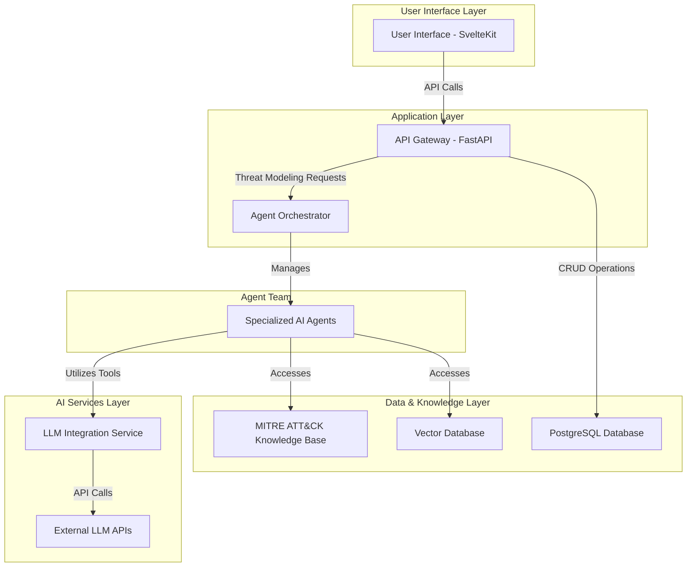

# AITM System Description

## 1. Introduction

### 1.1 Purpose
This document provides a detailed technical description of the AI-Powered Threat Modeler (AITM) platform. It is intended for system administrators, developers, and security architects who need to understand the system's architecture, components, and design principles.

### 1.2 Scope
AITM is a full-stack web application designed to automate and enhance the threat modeling process. This document covers:
- High-level system architecture
- Backend and frontend component design
- Data models and database schema
- Multi-agent system architecture
- Core functionalities and workflows

---

## 2. System Architecture

AITM is built on a modern, scalable, and maintainable microservices-based architecture.

### 2.1 High-Level Architecture Diagram



### 2.2 Core Components

- **Frontend**: A responsive SvelteKit single-page application (SPA) that provides the user interface.
- **Backend**: A FastAPI application that serves the API, manages business logic, and orchestrates the AI agents.
- **Database**: A PostgreSQL database for persistent storage of projects, assets, and analysis results.
- **AI Agents**: A multi-agent system built with LangGraph for performing specialized threat modeling tasks.
- **LLM Integration**: A service to connect with various Large Language Models (LLMs) like GPT, Gemini, and Claude.

### 2.3 Technology Stack

| Layer       | Technology                                         |
|-------------|----------------------------------------------------|
| **Frontend**  | SvelteKit, TypeScript, TailwindCSS, Vite           |
| **Backend**   | Python, FastAPI, SQLAlchemy, Alembic, LangGraph     |
| **Database**  | PostgreSQL, VectorDB (e.g., PGVector)              |
| **AI/ML**     | LangChain, Transformers, various LLM SDKs        |
| **Deployment**| Docker, Docker Compose, Nginx                      |
| **Testing**   | Pytest (backend), Playwright (E2E)                 |

---

## 3. Backend System Design

The backend is a modular FastAPI application responsible for the core business logic.

### 3.1 API Endpoints

The backend exposes a RESTful API for all platform functionalities.

- `POST /api/v1/projects/`: Create a new project.
- `GET /api/v1/projects/`: List all projects.
- `GET /api/v1/projects/{id}`: Get a single project.
- `POST /api/v1/projects/{id}/inputs`: Add system inputs to a project.
- `POST /api/v1/threat-modeling/{id}/analyze`: Start a threat modeling analysis.
- `GET /api/v1/threat-modeling/{id}/status`: Check analysis status.
- `GET /api/v1/threat-modeling/{id}/results`: Get analysis results.

### 3.2 Database Schema

The database schema is managed using SQLAlchemy and Alembic for migrations.

**Core Tables:**
- `projects`: Stores threat modeling projects.
- `system_inputs`: Stores user-provided system descriptions.
- `assets`: Identified system assets and their criticality.
- `threats`: Identified threats mapped to MITRE ATT&CK.
- `mitigations`: Recommended security controls.
- `reports`: Generated analysis reports.

**Example `projects` table schema:**
```sql
CREATE TABLE projects (
    id SERIAL PRIMARY KEY,
    name VARCHAR(255) NOT NULL,
    description TEXT,
    status VARCHAR(50) DEFAULT 'created',
    created_at TIMESTAMP WITH TIME ZONE DEFAULT CURRENT_TIMESTAMP,
    updated_at TIMESTAMP WITH TIME ZONE DEFAULT CURRENT_TIMESTAMP
);
```

### 3.3 Multi-Agent System Architecture

AITM uses a multi-agent system to automate complex analysis tasks. The system is orchestrated by a Master Orchestrator Agent.

**Agent Roles:**
1.  **System Analyst Agent (SAA)**: Analyzes system descriptions to identify components, data flows, and attack surfaces.
2.  **ATT&CK Mapper Agent (AMA)**: Maps system characteristics to MITRE ATT&CK techniques.
3.  **Control Evaluation Agent (CEA)**: Evaluates existing security controls against identified threats.
4.  **Risk Assessment Agent (RAA)**: Assesses the likelihood and impact of threats to determine risk levels.
5.  **Mitigation Recommendation Agent (MRA)**: Generates actionable mitigation recommendations.

---

## 4. Frontend System Design

The frontend is a modern SvelteKit application providing a rich, interactive user experience.

### 4.1 Component Architecture

The UI is built using a component-based architecture.

- **Layouts**: Main application layout with sidebar and header.
- **Routes**: SvelteKit routes for each page (e.g., `/dashboard`, `/projects`).
- **Components**: Reusable UI elements (e.g., `Button`, `Modal`, `DataTable`).
- **Stores**: Svelte stores for managing global application state (e.g., current user, theme).

### 4.2 State Management
- **Local State**: Managed within individual Svelte components.
- **Global State**: Managed using Svelte's writable and readable stores for cross-component state sharing.
- **API Data**: Fetched and cached using async functions within component load scripts.

### 4.3 Key UI Features

- **Responsive Design**: Adapts to desktop, tablet, and mobile viewports.
- **Dark/Light Mode**: User-selectable theme preference.
- **Real-time Updates**: Fetches analysis status and results periodically.
- **Interactive Visualizations**: Uses Chart.js for data visualization.

---

## 5. System Workflows

### 5.1 Threat Modeling Workflow

1.  **User creates a project**: Enters a name and description.
2.  **User provides system inputs**: Describes the system architecture, data flows, etc.
3.  **User starts analysis**: Selects analysis depth and LLM provider.
4.  **Backend orchestrates agents**: The orchestrator assigns tasks to the SAA, AMA, CEA, etc.
5.  **Agents perform analysis**: Each agent uses its specialized knowledge and LLM capabilities.
6.  **Results are generated**: The system compiles agent outputs into a structured threat model.
7.  **User reviews results**: The user interface displays the identified threats, risks, and mitigations.

### 5.2 User Authentication Workflow

1.  User enters credentials on the login page.
2.  Frontend sends credentials to the `/api/v1/login` endpoint.
3.  Backend verifies credentials and issues a JWT token.
4.  Frontend stores the JWT token and includes it in subsequent API requests.
5.  Backend validates the JWT on each protected API call.

---

## 6. Security Overview

### 6.1 Authentication and Authorization
- **Authentication**: JWT-based authentication for stateless sessions.
- **Authorization**: Role-based access control (Admin, Analyst, Viewer).
- **Password Security**: Passwords are not stored; they are hashed using bcrypt.

### 6.2 Data Security
- **Data in Transit**: All communication is encrypted using TLS 1.2+.
- **Data at Rest**: Sensitive data in the database is encrypted.
- **Input Sanitization**: Pydantic models on the backend validate and sanitize all incoming data.

### 6.3 API Security
- **CORS**: Configured to only allow requests from the trusted frontend domain.
- **Rate Limiting**: Implemented to prevent abuse.
- **Prompt Injection Mitigation**: Techniques are used to sanitize inputs before sending them to LLMs.

---

## 7. Deployment and Operations

### 7.1 Containerization
- **Docker**: All services are containerized for portability and consistency.
- **Docker Compose**: Used to manage multi-container application deployment in development and production.

### 7.2 Production Environment
- **Web Server**: Nginx is used as a reverse proxy and for serving static frontend assets.
- **Database**: A production-grade PostgreSQL instance is recommended.
- **Logging**: Structured logging to files, with log rotation configured.
- **Monitoring**: Health check endpoints for each service for external monitoring.

For more details, refer to the [Production Deployment Guide](./PRODUCTION_DEPLOYMENT_GUIDE.md).
